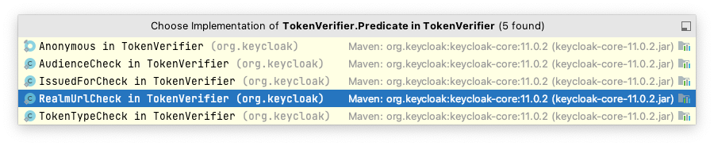
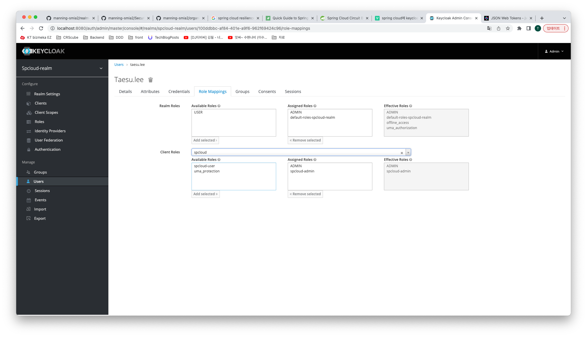
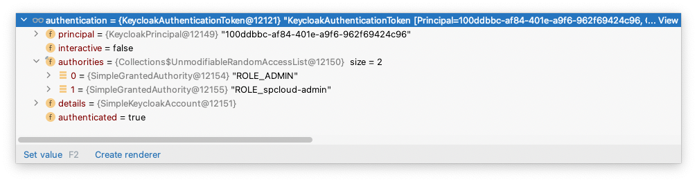

토큰 생성 후 Bearer로 넣었으나 401이 떨어진다면  org.keycloak.TokenVerifier 클래스 디버깅    
아래 checkes 들을 통해 체크 함  


권한이 맞지 않다면 org.keycloak.adapters.springsecurity.filter. KeycloakAuthenticationProcessingFilter에서 권한검사 부분을 확인  

AbstractSecurityInterceptor, Jsr250Voter에서 아래 토큰을 받으면    
```text
eyJhbGciOiJSUzI1NiIsInR5cCIgOiAiSldUIiwia2lkIiA6ICJ2N2wxYW5kLW5QMXZZOFhKNTQtQkZtUVBOcFpDNVJCR1BLWFRBZkNlb3ZZIn0.eyJleHAiOjE2NjcwMzE1ODUsImlhdCI6MTY2NzAzMTI4NSwianRpIjoiYWFmZDhiOGItMDQ5ZS00OWRjLWJjOTMtMTRlZjQ1MTExMThmIiwiaXNzIjoiaHR0cDovL2xvY2FsaG9zdDo4MDgwL2F1dGgvcmVhbG1zL3NwY2xvdWQtcmVhbG0iLCJhdWQiOiJhY2NvdW50Iiwic3ViIjoiMTAwZGRiYmMtYWY4NC00MDFlLWE5ZjYtOTYyZjY5NDI0Yzk2IiwidHlwIjoiQmVhcmVyIiwiYXpwIjoic3BjbG91ZCIsInNlc3Npb25fc3RhdGUiOiIxMWZjOWE3Yi0yOGUwLTQ4NTMtOWEzNC05YWNiZDMzY2NhZDciLCJhY3IiOiIxIiwiYWxsb3dlZC1vcmlnaW5zIjpbIioiXSwicmVhbG1fYWNjZXNzIjp7InJvbGVzIjpbImRlZmF1bHQtcm9sZXMtc3BjbG91ZC1yZWFsbSIsIm9mZmxpbmVfYWNjZXNzIiwiUk9MRV9BRE1JTiIsInVtYV9hdXRob3JpemF0aW9uIiwiQURNSU4iXX0sInJlc291cmNlX2FjY2VzcyI6eyJzcGNsb3VkIjp7InJvbGVzIjpbIkFETUlOIiwic3BjbG91ZC1hZG1pbiJdfSwiYWNjb3VudCI6eyJyb2xlcyI6WyJtYW5hZ2UtYWNjb3VudCIsIm1hbmFnZS1hY2NvdW50LWxpbmtzIiwidmlldy1wcm9maWxlIl19fSwic2NvcGUiOiJwcm9maWxlIGVtYWlsIiwiZW1haWxfdmVyaWZpZWQiOnRydWUsInByZWZlcnJlZF91c2VybmFtZSI6InRhZXN1LmxlZSJ9.LeaEFydP0DS1z1zxy_R0o2siWHUkZtI5O-9rYcQLoTWQiAOKdoXgZNbBZqA9-HTQmGDZh8z-UT0AKD6scSjF-tKR44_GUcLrD-lJb5WrI8xWFuEyZeLhpIZKLMWha1mMZZVQZKiyMxYLzJXosCYRmWNPyQLo-Xdq0M6wJP5gGNwYnGNkeh3ux2R29MYIXNJhh9HKQBjgk1VjtlMKsFESrHR1hYKEr8JGDHpGaQ-6R93byL2sgLOc6Nidx2XiF3bfmOOtjmNlcfB1UX_loygw5YZOs80dHQO4gYGqI_J8U0KkucR8MaJxXL0WI9BcbM6-ZSWVmlHu0zShGJ05lfMbOQ
```
keycloak에서 설정한대로 권한이 내려 옴



resource_access.spcloud.roles
```json
{
  "exp": 1667031585,
  "iat": 1667031285,
  "jti": "aafd8b8b-049e-49dc-bc93-14ef4511118f",
  "iss": "http://localhost:8080/auth/realms/spcloud-realm",
  "aud": "account",
  "sub": "100ddbbc-af84-401e-a9f6-962f69424c96",
  "typ": "Bearer",
  "azp": "spcloud",
  "session_state": "11fc9a7b-28e0-4853-9a34-9acbd33ccad7",
  "acr": "1",
  "allowed-origins": [
    "*"
  ],
  "realm_access": {
    "roles": [
      "default-roles-spcloud-realm",
      "offline_access",
      "ROLE_ADMIN",
      "uma_authorization",
      "ADMIN"
    ]
  },
  "resource_access": {
    "spcloud": {
      "roles": [
        "ADMIN",
        "spcloud-admin"
      ]
    },
    "account": {
      "roles": [
        "manage-account",
        "manage-account-links",
        "view-profile"
      ]
    }
  },
  "scope": "profile email",
  "email_verified": true,
  "preferred_username": "taesu.lee"
}
```
